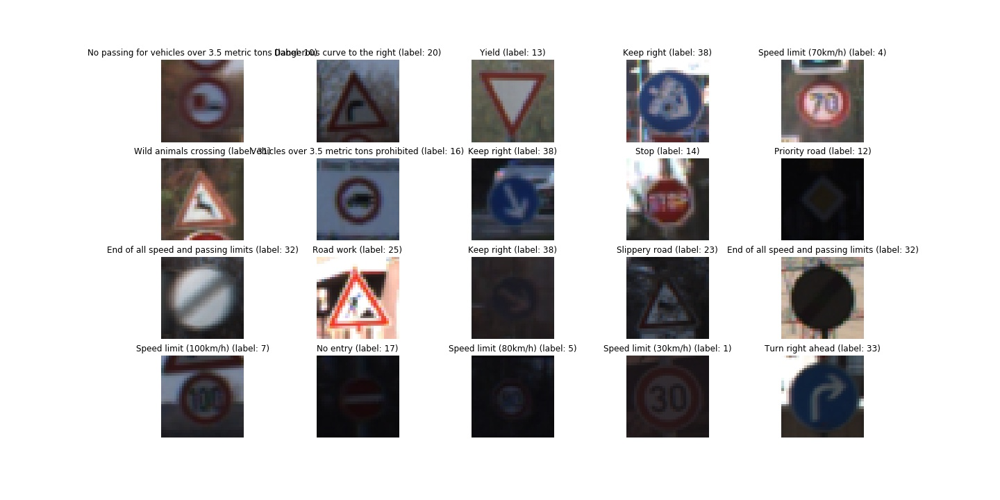
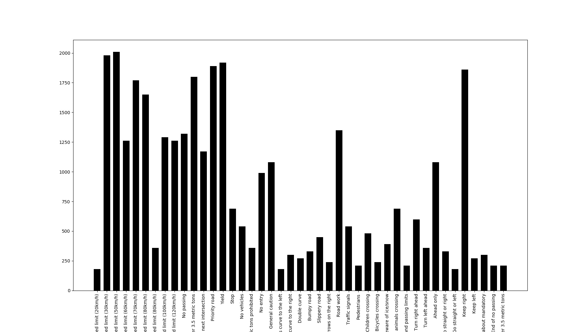
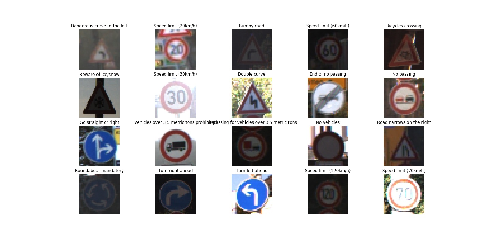
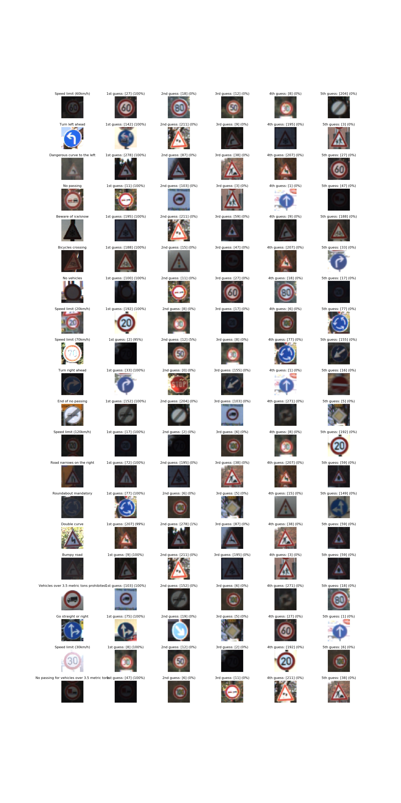

# Udacity's Self-Driving Car Engineer Nanodegree: Traffic Sign Recognition Project
This is Stephan Studener's solution to the traffic sign recognition project in Udacity's Self-Driving Car Engineer Nanodegree in December 2019. The project was completely implemented as a Python3 Jupyter-Notebook [`project.jpynb`](project.ipynb). In this project, the goal is to implement and train a convolutional neural network that classifys traffic signs on images. The neural network is trained, validated and tested with images provided by Udacity. As a final challenge, the neural network must be applied to classify images of the the German Traffic Sign Recognition Benchmark. 

*Note: After downloading, you need to un-zip the zip-files in the data-folder. These contain compressed training- / validation- / test-data.*

## 1. Data Set Summary & Exploration
First, the data set is explored.
#### 1.1. Summary of the data set
In the code, the analysis is done using python list's methods and fucntion from the numpy package.
The summary statistics of the traffic signs data set is given as follows:
* The size of training set is 34799
* The size of the validation set is 4410
* The size of test set is 12630
* The shape of a traffic sign image is (32, 32, 3)
* The number of unique classes/labels in the data set is 43

#### 1.2. Visualization of the dataset
The dataset consist of 43 classes, these are the following traffic signs:
* 0: Speed limit (20km/h)
* 1: Speed limit (30km/h)
* 2: Speed limit (50km/h)
* 3: Speed limit (60km/h)
* 4: Speed limit (70km/h)
* 5: Speed limit (80km/h)
* 6: End of speed limit (80km/h)
* 7: Speed limit (100km/h)
* 8: Speed limit (120km/h)
* 9: No passing
* 10: No passing for vehicles over 3.5 metric tons
* 11: Right-of-way at the next intersection
* 12: Priority road
* 13: Yield
* 14: Stop
* 15: No vehicles
* 16: Vehicles over 3.5 metric tons prohibited
* 17: No entry
* 18: General caution
* 19: Dangerous curve to the left
* 20: Dangerous curve to the right
* 21: Double curve
* 22: Bumpy road
* 23: Slippery road
* 24: Road narrows on the right
* 25: Road work
* 26: Traffic signals
* 27: Pedestrians
* 28: Children crossing
* 29: Bicycles crossing
* 30: Beware of ice/snow
* 31: Wild animals crossing
* 32: End of all speed and passing limits
* 33: Turn right ahead
* 34: Turn left ahead
* 35: Ahead only
* 36: Go straight or right
* 37: Go straight or left
* 38: Keep right
* 39: Keep left
* 40: Roundabout mandatory
* 41: End of no passing
* 42: End of no passing by vehicles over 3.5 metric tons
Here is a visualization of some samples of the  training data set. 

Here is a bar chart showing the frequency of each class in the training set.

If the number of images in a particular class is high then test accuracy for particular class will be high because the network has plenty of chances to train on that particular class.

## 2. Design and Test a Model Architecture
A neural network following the Lenet architecture is implemented and trained. The network is validated and tested before it is exposed to new images from the German Traffic Sign Recognition Benchmark. 
### 2.1. Preprocessing of data
The helper function preProcessData converts RGB-images to grayscale by applying "gray-value = (red-value + green-value + blue-value) / 3". It then normalizes the grayscale image by applying "(intensity / 128) - 128", such that the new intensity is in between -1 and 1. Each image must be processed this way since the neural network takes single channel images as input (the infomration contained in the colors are not used!).

### 2.2. Defining the neural network's architecture
The model (synonym for the neural network) is implemented in the function "LeNet". The architecture is:   
* Layer 1: Convolutional. Input = 32x32x1. Output = 28x28x6.
* Activation.
* Pooling. Input = 28x28x6. Output = 14x14x6.    
* Layer 2: Convolutional. Output = 10x10x16.                    
* Activation.
* Pooling. Input = 10x10x16. Output = 5x5x16.
* Flatten. Input = 5x5x16. Output = 400.    
* Layer 3: Fully Connected. Input = 400. Output = 120.   
* Activation.    
* Dropout.
* Layer 4: Fully Connected. Input = 120. Output = 84.  
* Activation.
* Dropout.
* Layer 5: Fully Connected. Input = 84. Output = 43.
The Lenet architecture is used for classification, because It takes 32x32 images as input which is the same dimension same as the images provided in the training, testing and validation sets.

### 2.3. Training of the neural network
Adam-Optimizer is utilized as optimizer. The hyperparameters for training are

* Epochs: 200
* Batch-size: 100
* Learning-rate: 0.00025

The training sequence is encapsulated in the function "train". After each epoch, statistics are printed to the bash.
The output of the training yields

* Epoch 1:  Validation Accuracy = 0.442   Training Accuracy = 0.506 
* Epoch 2:  Validation Accuracy = 0.667   Training Accuracy = 0.746 
* Epoch 3:  Validation Accuracy = 0.729   Training Accuracy = 0.820 
* ...
* Epoch 200:  Validation Accuracy = 0.910   Training Accuracy = 1.000

#### Remarks on hyperparameters added after Review of 1st Submission
The learning rate is chosen based on prior numerical experiments with different learning rates of higher order of magnitude. The order of magnitude was decreased from 0.01 down to 0.0001.
It was noticed, that the losses decay faster in the first place but then converge at a higher level. 
On the other hand, the smaller learning rate required more epochs for reduction of the loss.
I balanced slow convergence properties of a small learning rate (less change of the networks weights) at the order of magnitude of 0.0001 with large numbers of epochs and found the parameters above to deliver sufficient results.

The Adam-Optimizer has been chosen initially and kept for all numerical experiments that lead to the final reult; it wad found in the LeNet lab and hence being accepted as approriate for the purpose.

### 2.4. Accuracy
The final results obtained on the training set, the validation set and the test set are

* Training set accuracy: 1.000
* Validation set accuracy: 0.917
* Test set accuracy = 0.912

The model is identifying more than 90% of the traffic signs in the testing data set. 

## 3. Test a Model on New Images from the German Traffic Sign Recognition Benchmark
In the following the model is exposed to images from the German Traffic Sign Recognition Benchmark. 
### 3.1. Summary of the data set
In the figure below the subset of images from the German Traffic Sign Recognition Benchmark are shown. 20 images have been downloaded and stored in the folder /data/. These must be classified using the model.

### 3.2. Results

One prediction out of 20 is wrong when feeding the images from the German Traffic Sign Recognition Benchmark into the model. The detailed results are given below:

* Correct: 'Speed limit (60km/h)' has been predited as 'Speed limit (60km/h)'.
* Correct: 'Turn left ahead' has been predited as 'Turn left ahead'.
* Correct: 'Dangerous curve to the left' has been predited as 'Dangerous curve to the left'.
* Correct: 'No passing' has been predited as 'No passing'.
* Correct: 'Beware of ice/snow' has been predited as 'Beware of ice/snow'.
* Correct: 'Bicycles crossing' has been predited as 'Bicycles crossing'.
* Correct: 'No vehicles' has been predited as 'No vehicles'.
* Correct: 'Speed limit (20km/h)' has been predited as 'Speed limit (20km/h)'.
* Correct: 'Speed limit (70km/h)' has been predited as 'Speed limit (70km/h)'.
* Correct: 'Turn right ahead' has been predited as 'Turn right ahead'.
* Correct: 'End of no passing' has been predited as 'End of no passing'.
* Correct: 'Speed limit (120km/h)' has been predited as 'Speed limit (120km/h)'.
* Correct: 'Road narrows on the right' has been predited as 'Road narrows on the right'.
* Correct: 'Roundabout mandatory' has been predited as 'Roundabout mandatory'.
* Correct: 'Double curve' has been predited as 'Double curve'.
* Wrong:   'Bumpy road' has been predited as 'Dangerous curve to the right'.
* Correct: 'Vehicles over 3.5 metric tons prohibited' has been predited as 'Vehicles over 3.5 metric tons prohibited'.
* Correct: 'Go straight or right' has been predited as 'Go straight or right'.
* Correct: 'Speed limit (30km/h)' has been predited as 'Speed limit (30km/h)'.
* Correct: 'No passing for vehicles over 3.5 metric tons' has been predited as 'No passing for vehicles over 3.5 metric tons'.

The accuracy attained with German traffic sign images from the German Traffic Sign Recognition Benchmark database is 0.950.

### 3.3. Softmax probabilities for each prediction
In the following the model's softmax probabilities are computed to show the certainty of the model's predictions.
In the figure the target images from the German Traffic Sign Recognition Benchmark are displayed in the first column.
Next to each each target image, in the same row, the most certain guess given by the model is displayed. The most certain guess is displayed using one respresentative taken from the training set.
In the same row the remaining top-4-guesses are also displayed with one of their respresentatives in the training set.

#### Remarks on Testing the Model on New Images added after Review of 1st Submission
This submission includes 20 new German Traffic signs found on the web; the major interest of this study was to see how the model performs on different traffic signs. This submission covers roughly half of the set of classes that have been available in the training set with new images from the German Traffic Sign Recognition Benchmark.
When reviewing my work, I noticed, that figure 22.ppm in my subset of the German Traffic Sign Recognition Benchmark must be called 20.ppm and is a "Dangerous curve to the right".  The image was classified in a correct manner by the model but the image is labeled in a wrong fahsion. This is a mistake I made whan coping and renaming the images form the German Traffic Sign Recognition Benchmark. The accuracy of the model on the subset kept in the folder /data/ increases to 100% when respecting this error in labeling.

When searching for the images, I tried to look for ones, that display traffic signs in a way they appear to a front camera of a car. I checked backed on my car and found the front camera to be under the rear mirror looking at the street from a perspective somewhat "in between the frontseets".
Such a camera will detect the image from a certain distance as opposed to the perspective you get when standing below a traffic signs and looking at it from below. I looked for images that display some extreme brightness (such as the "Speed Limit 70 km/h"-Sample) and darkness (such as the "Speed Limit 70 km/h"-Sample), because I assume that these conditions occur when driving against the sun or under low light.

Recalling one image to be miss-labeled, the model performed well when taking the "front camera-perspective".
